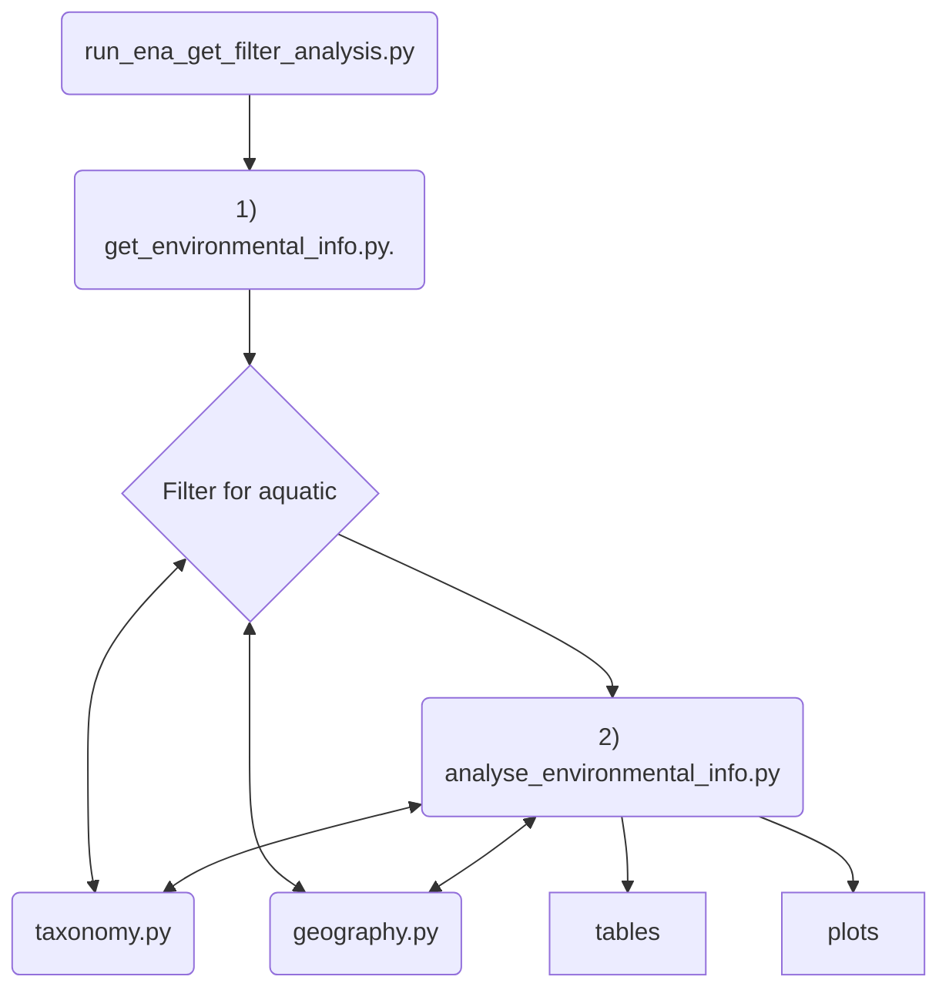

# eDNAAqua-Plan
eDNAqua-Plan code and data used for some of the deliverables of the overall eDNAAquaPlan.

This currently focuses on T2.2 in WP2. D2.2: Report containing an inventory of the ongoing and completed eDNA initiatives and repositories, identifying their geographical, ecological and taxonomic coverages.

EMBL-EBI Authors: Peter Woollard, Jose Burgin, Joana Pauperio and Stephane Pesant.

## Focus on ENA environmental DNA
