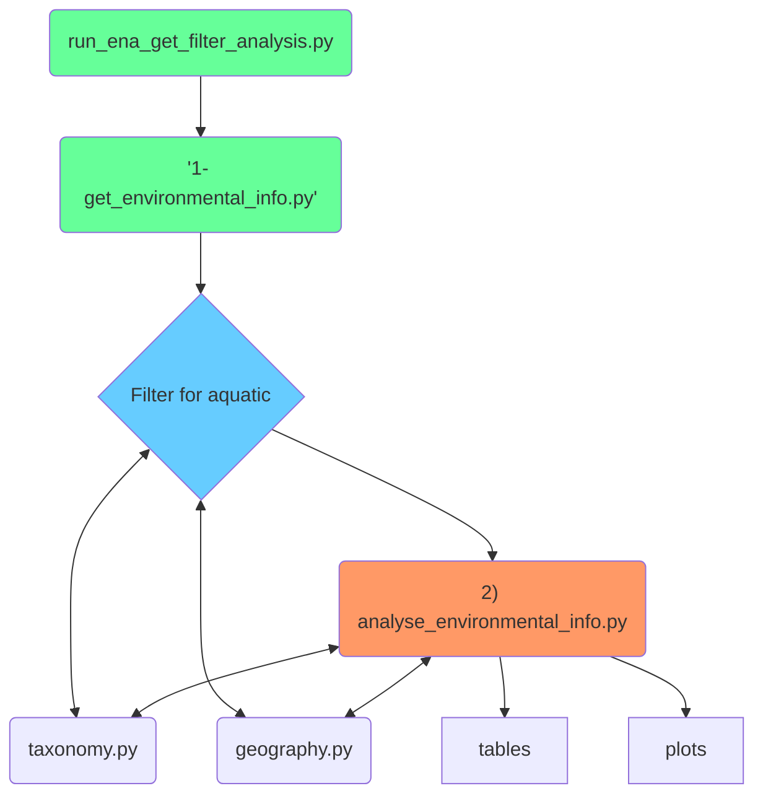
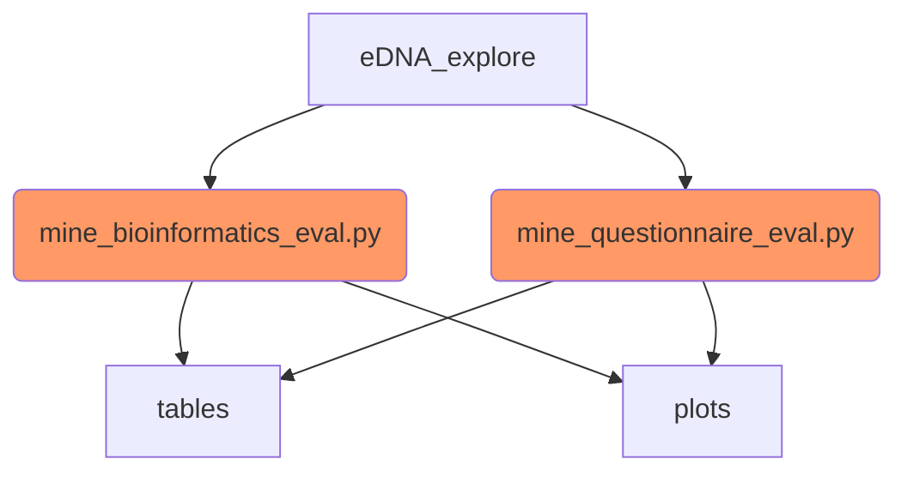
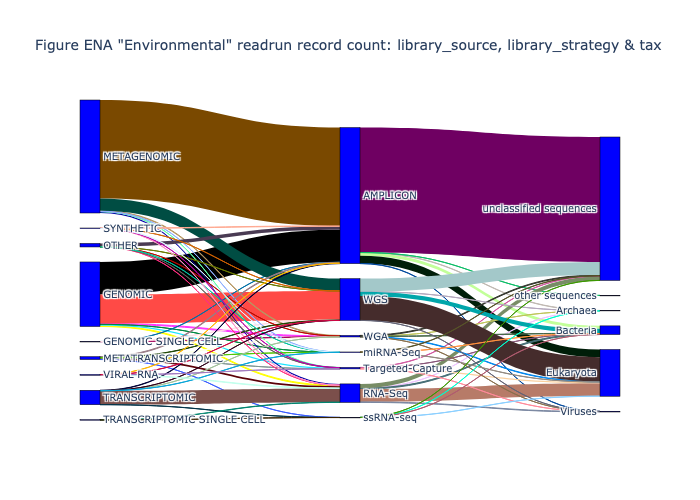

# eDNAqua-Plan

eDNAqua-Plan code and data used for some of the deliverables of the overall eDNAAquaPlan.
N.B. This cose is very rough and ready! It is generated tables and plots for the report.

This currently focuses on the needs of T2.2 in WP2. D2.2: Report containing an inventory of the ongoing and completed eDNA initiatives and repositories, identifying their geographical, ecological and taxonomic coverages.

Much data is being generated collated by the bioinformatics team of WP2, including:
Yannis Kavakiotis and Dawid Krawczyk.

 Biodiversity and marine guidance from Joana Pauperio and Stephane Pesant.

## Focus on ENA environmental DNA

## Focus on general environmental DNA

## Other Information
- [Overview of the aquatic filtering](docs/details/aquatic_filtering.md)
- [Where eDNA archives fit, overview](docs/details/where_eDNA_archives_fit.md)
- Plot of experiment related info

